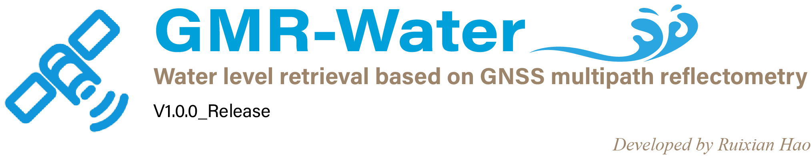
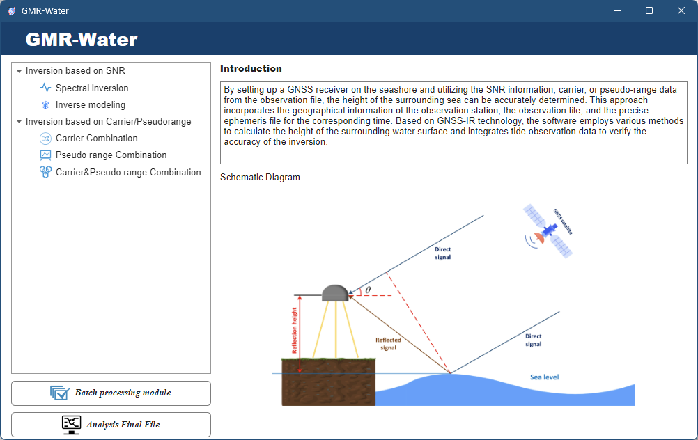

# **GMR-Water: A Water Level Retrieval Software for Multi-GNSS, Multi-Frequence and Multi-Observation Based on GNSS-MR**

China university of mining and technology, Beijing

# **Introduction**

With the continuous development of Global Navigation Satellite Systems (GNSS), contemporary receivers can capture multi-frequency signals from multiple GNSS systems, including GPS, Galileo, GLONASS, and BDS. This progress is undoubtedly conducive to the development of GNSS-MR technology. Moreover, traditional GNSS-MR water level retrieval techniques predominantly rely on Signal-to-Noise Ratio (SNR) observations. Nevertheless, it has been demonstrated that both carrier phase and pseudo range observations also possess the potential for water level retrieval. Incidentally, there have been certain advancements in the combination methods for multi-frequency results as well. In response to these developments, we have developed a software named GMR-Water, which is based on MATLAB, for water level retrieval. This software accomplishes water level retrieval by utilizing multi-frequency, multi-system, and multi-observation values, thereby significantly augmenting the retrieval accuracy and temporal resolution in comparison to traditional techniques. Additionally, the software incorporates two multi-frequency fusion algorithms, generating water level retrieval information at uniform sampling intervals, thus further promoting the development of GNSS-MR water level retrieval technology.

**Key Features**

1. Multi-GNSS: water level retrieval based on GPS, Galileo, GLONASS, and BDS.
2. Multi-Frequence: support for all frequence bands.
3. Multi-Observation: water level retrieval based on SNR, Carrier phase and pseudo range.
4. Advanced error correction techniques (tropospheric correction, dynamic tide level correction, etc.) are applied for high-precision water level retrieval.
5. Efficient data processing capability through parallel batch processing.
6. Innovative methods for the combination of multi-frequence results.
7. Comprehensive data visualization tools and a user-friendly interactive interface.

# **Operation**

## Dependencies

GMR-Water requires MATLAB 2022a or later versions to operate.

## Starting

The GMR-Water software offers two initialization modes: it can be executed either through an interactive graphical user interface (GUI) or via function calls in batch processing mode using scripts.
<u>**Run in GUI mode**</u>
The main interface of the software is "**Start.mlapp**", as shown in Figure 1. The left side of the software features the functional area, which includes modules for five water level retrieval methods using multi-observation (SNR, carrier phase and pseudo range), along with the "batch processing" and the "analysis final file". On the right side of the start interface, there is an introduction and schematic diagram of GNSS-MR technology.

**Figure 1.** The start interface of GMR-Water

<u>**Run as a function**</u>

The main function of GMR-Water is"**GMR_Water.m**", which can be executed by providing an input configuration structure "Settings" or by simply typing
GMR_Water in the command line to run a demo case. The GMR_Water function integrates water level retrieval, result analysis, customizable parameter configuration, and parallel processing capabilities.

# **Contact**

If you have any questions about this software or have suggestions for improvement, please feel free to contact us.

Fei Yang: [yangfei@cumtb.edu.cn](mailto:yangfei@cumtb.edu.cn)

Ruixian Hao: [2110200210@student.cumtb.edu.cn](mailto:2110200210@student.cumtb.edu.cn)

<Vitamin_N@outlook.com>